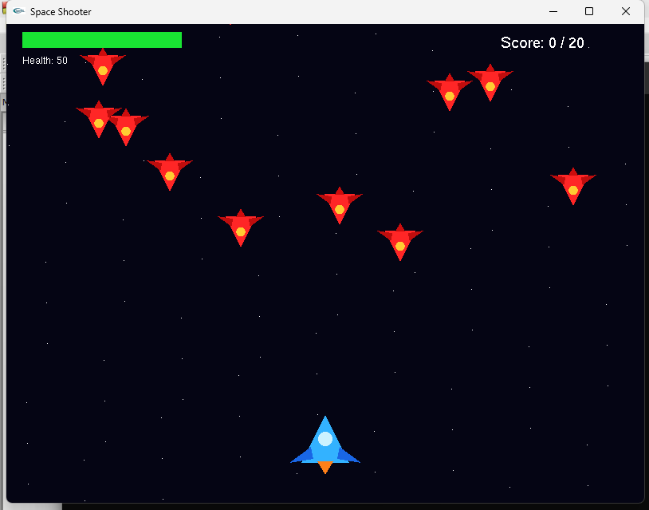
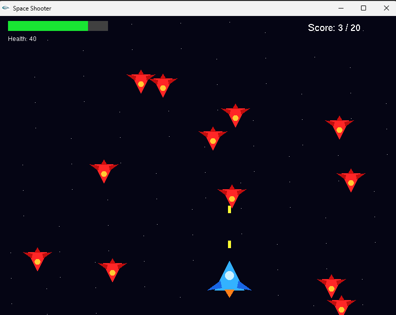

# SpaceShooter

A simple 2D Space Shooter game developed using **C++ and OpenGL (GLUT)**.

The player controls a spaceship, moves it horizontally and shots the incoming enemy spaceship. The goal is to destroy enough enemies while keeping the player's health avobe zero.

---
## Setup Instructions

### Dependencies

The project was developed using following components. 

1. **Code::Blocks 10.5**
2. **MinGW**
3. **OpenGL**
4. **GLUT 3.7.6**

### Download links 

1. Code::Blocks 10.5 -> https://sourceforge.net/projects/codeblocks/files/Binaries/10.05/

2. GLUT 3.7.6 -> https://drive.google.com/file/d/1dDcGy4WEz7zUBezZ0Wk8KG4XAP5cWQHM/view

<<<<<<< HEAD
## What the Project Does 

This is a 2D spaceshooter game built using C++ and OpenGL(GLUT).

The player controls a spaceship at the bottom of the screen and must shoot down enemy spaceships coming from the top before they collide with player.

**Gameplay Details:**

- Movement: The player can move the spaceship left and right using the A/D keys or the arrow keys.

- Shooting: Pressing Spacebar fires a bullet upward from the player's ship.

- Enemies: Enemy spaceships spawn randomly at the top of the screen and move downward toward the player.

- Combat: If a bullet hits an enemy, the enemy is destroyed and the player's score increase by 1.

- Health: If an enemy collides with the player's ship instead of being shot, the player loses health(5 points). The current health is shown as a health bar and text at top of the screen.

- Win Condition: The player will win the game if they reach a score of 20.

- Lose Condition: The game ends if the player's health drops to 0.

- Restart: Pressing R restarts the game at any time.

- Visuals: The game has a starry background, and the spaceships(mine and the enemies) are made from simple shapes like triangles and circles, colored differently so you can tell your ship apart from enemy ships.

=======
=======
### Environment Setup

Frist download Code::Blocks and extract the GLUT 3.7.6.

Then follow the steps given below.

1. Copy glut32.dll to C:\Windows\System32 (32 bit) or C:\Windows\SysWOW64 (64 bit).
2. Copy glut32.lib to C:\Program Files (x86)\CodeBlocks\MinGW\lib
3. Copy glut.h to C:\Program Files (x86)\CodeBlocks\MinGW\include\GL

After these step the Code::Blocks is ready for the project to run in the locl machine. 

>>>>>>> 94c2c1133832251ae35f32f6fcb262aec0b18452
## **Output**

After successfully executing the code, in our outputs we can see that everything appears perfectly. The blue spaceship appears in the bottom and the enemy spaceship coming from the top to the bottom. We can also see the health bar appears at the top left and the scorecard at the top right.

## **Output Screenshot**

